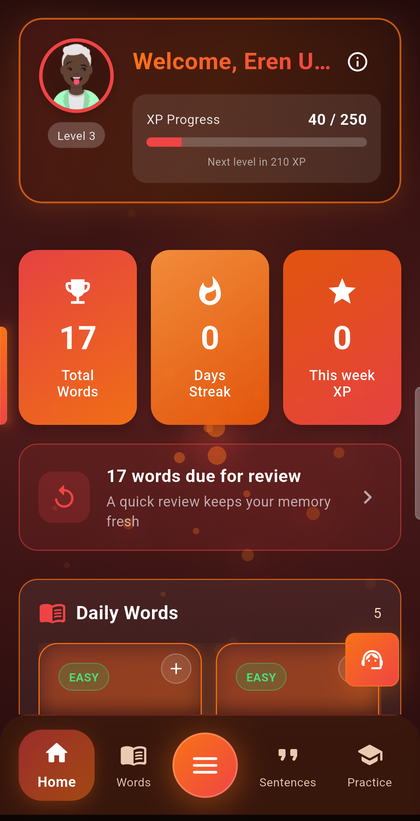
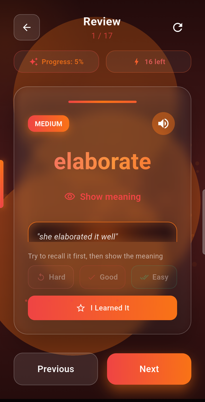
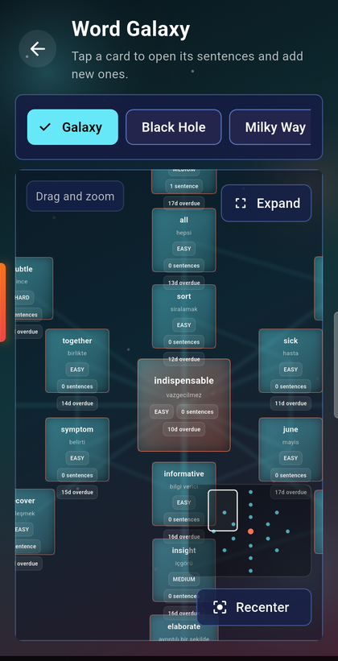
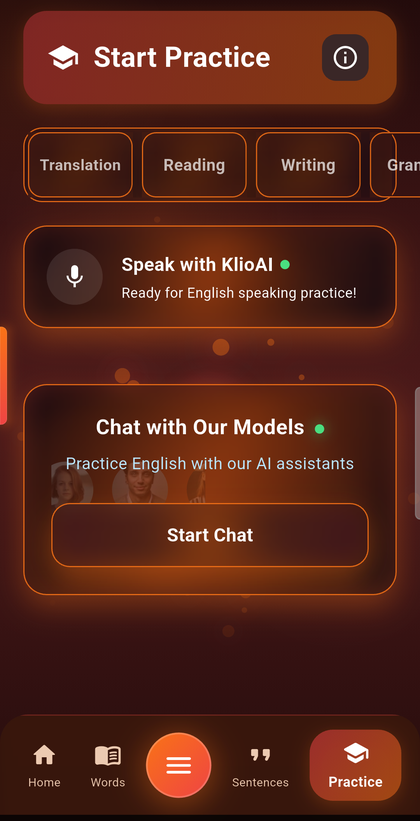
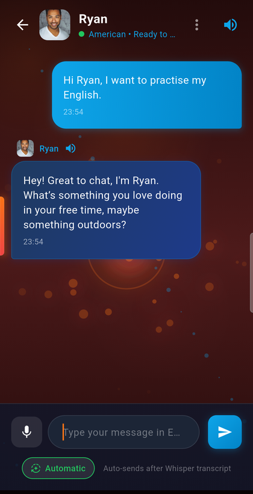
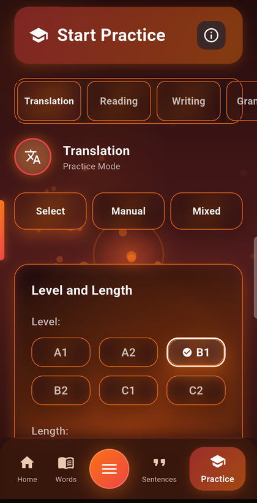

# KlioAI

**An English learning app built around the words you actually keep.**

Most vocabulary apps hand you a fixed word list. KlioAI is built the other way round: you
collect the words you meet, and every other feature — spaced review, example sentences,
grammar drills, speaking practice — is generated from *your* list.

Flutter client · Spring Boot backend · Turkish → English

<a href="https://play.google.com/store/apps/details?id=com.VocabMaster">
  
</a>

---

## The app

| | | |
|:--:|:--:|:--:|
|  |  |  |
| **Home** — daily words, streak, and what is due today | **Review** — recall first, then grade yourself | **Word Galaxy** — your vocabulary as a map |
|  |  |  |
| **Practice** — translation, reading, writing, grammar | **Speaking** — talk to a chosen voice, transcribed by Whisper | **Levels** — every generator is CEFR-aware |

---

## How the learning loop works

**1. Collect.** Add a word by hand, from the built-in dictionary, or from the daily word
set. Sentences attach to words, so vocabulary and context stay together.

**2. Review.** Cards are scheduled with SM-2 spaced repetition. The card shows the word
first and hides the meaning behind a deliberate tap — grading yourself before you have seen
the answer is the part that makes the schedule mean anything. Hard / Good / Easy feed back
into the interval.

**3. Practise.** Translation, reading, writing and grammar drills are generated at your CEFR
level. Grammar questions are built around words already in your list, so a tense drill is
also a vocabulary review.

**4. Speak.** Pick a voice and hold a conversation. Speech is transcribed with Whisper and
answered by the same model that runs the rest of the app.

Every graded recall — from classic review, Word Galaxy, translation practice or a grammar
quiz — is written to an append-only event log, so the schedule reflects everything the
learner did, not just what happened on one screen.

---

## Architecture

```text
flutter_vocabmaster/   Flutter mobile application
backend/               Spring Boot API, persistence, security, subscriptions
docs/                  Project notes and public documentation
scripts/               Local verification and operational helper scripts
```

**Mobile** — Flutter/Dart, offline-first local persistence, Google sign-in, Google Play
Billing, theme-aware components, English and Turkish throughout.

**Backend** — Java 21 / Spring Boot, PostgreSQL with Flyway migrations, Redis for rate
limiting and AI quota accounting, JWT auth with refresh-token rotation, server-side Google
Play subscription verification.

**AI** — Groq (`gpt-oss-120b` / `gpt-oss-20b`) for generation, `whisper-large-v3-turbo` for
speech, self-hosted [Piper](https://github.com/rhasspy/piper) for text-to-speech. Every AI
call is proxied, quota-checked and metered server-side; no provider key ever reaches the
device.

**Notifications** — a single hourly job serves every timezone: each device is released on
its own local evening, and only if there is something genuinely due and the learner has not
already practised that day.

Tests: 974 backend, 333 client. Generated content has its own harness: mechanical checks
run in the ordinary suite against payloads captured from real production failures, and a
manually triggered workflow puts the four generators through a golden set of live calls
before a prompt change ships.

---

## Engineering notes

The interesting problems in this project were not the features. They were the failures that
looked like success. A few, with the commits that fixed them:

**Three months of hardcoded fallback sentences, reported as 100% healthy.**
The AI provider metric counted an empty completion as a success, because the HTTP request
had in fact worked — it just came back with nothing, and the caller quietly substituted a
template. "Answered with nothing" is now its own outcome with its own counter, distinct from
both success and error.

**Whisper transcribing an empty room.**
Recording silence produced fluent, confident text that was auto-sent to the tutor. Four
fixes went into the model's *output* — the wording, its confidence score, a confidence field
the API response did not contain — before the actual cause turned up in the *input*: a
priming prompt reading "English learning conversation. Transcribe the learner's English
speech exactly." Whisper's `prompt` parameter is prior transcript text, not an instruction,
so with no audio the model simply continued the sentence. The transcript began with the
prompt's own words. A microphone-level dynamic-range gate now stops silent clips before
they are ever uploaded.

**A daily reminder that reached nobody.**
The scheduler ran hourly for days reporting `considered=0`. The settings screen wrote the
reminder preference to one table; the sender read a denormalised copy in another that was
only ever written at device registration. The switch was on, the preference said true, and
nothing was sent.

**A free tier below the cost of a single request.**
One short conversation reported `1858/1500 tokens` and every AI feature went dark for the
day. The limit was declared in three property files and the one that actually won —
`application-prod.properties` — hardcoded it, so the other two read as authoritative and
were dead text.

The shape repeats: one fact stored in two places, and the read path holding the stale one.
None of these failed loudly. Each needed either production data or a phone in hand, which is
why the app now logs the *inputs* to its decisions and not only their outcomes, and why
learners can flag bad generated content in one tap from any screen that shows it.

The fallback-sentence failure is also why the prompts are no longer built inline inside
request handlers. The practice-sentence prompt is now a pure function with its exact output
pinned by a test, so changing it is a visible diff rather than a line that slips through in
an unrelated commit — and the eval calls that same function, because an eval that writes its
own prompt only proves the eval works.

**What the eval found on its first afternoon.**
Twelve cases across the four generators, checked mechanically: does the sentence contain the
word it was built around, is the correct answer among the options, is the quoted evidence
really in the passage. The first run scored 4 of 12. Reaching 12 took eight rounds, and the
findings split about evenly between the generators and the checks themselves.

The reading screen labels options by position and marks the one whose letter matches
`correctAnswer`. Two of the four passages were returning the answer written out in full,
which matches no letter — so every answer a learner gave on those was graded wrong. The
prompt's example had shown `"options": ["A", "B", "C", "D"]`, which reads as *the options
are the letters*. The grammar quiz was serving questions with four identical buttons; the
prompt asked for "exactly 4 options" and never said they had to differ. A past-simple drill
built on the learner's own vocabulary produced questions with no correct answer at all,
because two of the words were a noun and an adjective and a tense drill has to conjugate
something. One day's five vocabulary words were being discarded wholesale because *stadium*
came back with a single meaning, which is how many meanings stadium has.

The checks were wrong about as often. One looked for a field the generator has never
produced and called twenty healthy sentences broken. One was inverted, so it failed the
passages that worked and passed the ones that didn't. One graded sentences against CEFR
word-count bands invented on the spot, and failed a good sentence for being 21 words while
the same request asked for a "long" bucket defined as 16 or more. Every one of those is now
a regression test with the payload that produced it, because a check that fires on correct
output gets ignored within a week, and an ignored eval is worse than none — it looks like
coverage.

The repairs that stuck are the ones that keep the lesson rather than protect the invariant:
a question whose target word is a lie loses the label, not the question; an unverifiable
quote is dropped while the question stays; a quiz that cannot be built on the learner's
words is rebuilt without them. Dropping bad questions outright was tried first and produced
an empty practice screen, which is worse than what it replaced.

**The same audit, run across the generators the harness does not cover.**
Seven producer/consumer pairs — dictionary, writing topic, writing evaluation, pronunciation,
exam bundle, chat, translation check — audited in parallel against the question the reading
bug had answered the hard way: does the shape the backend produces match the shape the screen
consumes. Twenty-two candidates, ten surviving a reviewer whose instructions were to refute
them.

The worst was the same class of failure and worse in kind. The translation check inferred its
verdict from text whenever the reply was not JSON, and the inference defaulted to *correct* —
so a blank completion marked the learner's answer right, suppressed the correction, and wrote
a good recall to the spaced-repetition scheduler, lengthening the interval for a word they had
just failed. It also matched the Turkish word for "correct" anywhere in the reply, and the
feedback a wrong answer receives begins with it. Reporting no verdict at all turned out to
need no client work: the screen already skipped the scheduler write when the verdict was
absent. It had simply never been given one.

Elsewhere the backend was already marking its degraded payloads and the screens were not
reading the mark. The dictionary rendered "meaning temporarily unavailable" as a definition
with the save button live, so that string could become a permanent vocabulary entry and enter
the review rotation. Pronunciation practice labelled three canned sentences "text from your
words" and overwrote the sentence that really did contain them. A blank chat reply discarded
the learner's own message along with it, so the next answer came back out of context.

---

## Security and privacy

No production secret is committed to this repository. `.env.example` is a template; real
JWT secrets, database and Redis passwords, AI provider keys and Google Play service-account
credentials are supplied at runtime through environment variables or mounted secret files.

- Google-only account authentication
- Server-side Google Play subscription verification — the client cannot grant itself entitlements
- Per-plan AI token quotas, enforced in the backend
- Rate limiting on authentication, AI calls and support tickets
- Refresh-token rotation with session invalidation
- Support-ticket daily limits

---

## Local development

Client:

```bash
cd flutter_vocabmaster
flutter pub get
flutter analyze --no-fatal-infos
flutter test --reporter=compact
```

Backend:

```bash
cd backend
mvn test
```

Full stack, with `.env` populated from your own secret storage:

```bash
docker compose up -d
```

Before a production build, verify the backend environment is populated from real secret
storage and that release builds bundle no provider secrets.

---

## Status

Published on Google Play and under active development. The current focus is retention and
content quality: closing the loop between what learners report and what gets fixed, and
extending the generator eval from mechanical checks — is this output usable — to judged
ones, which is the part that needs a second model or a person. Mechanical checks can prove a
question is answerable. They cannot tell you it is worth answering.
