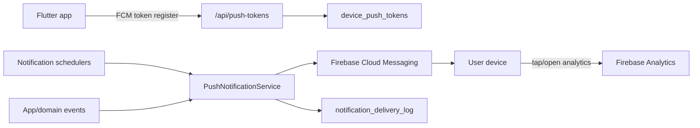

# KlioAI Notification System Design

Last update: 2026-05-31 Europe/Istanbul

## Current State

KlioAI already has the foundation for notifications.

Backend:

- `device_push_tokens` table exists through `V019`.
- `daily_reminders_enabled` exists through `V020`.
- `PushTokenController` registers and disables FCM tokens.
- `FirebaseMessagingProvider` can initialize Firebase Admin from a service account.
- `PushNotificationService` can send FCM notifications to a user or daily reminder tokens.
- `PushReminderScheduler` can send scheduled reminders.
- `notification_preferences` exists through `V024`.
- `notification_delivery_log` exists through `V024`.
- Admin test push endpoint exists at `POST /api/admin/push/test`.
- Admin push diagnostics endpoint exists at `GET /api/admin/push/status`.
- Production Firebase Admin delivery is enabled and verified; scheduled daily reminders remain disabled until preference UI and fresh-device smoke checks are complete.
- Legacy in-app `notifications` table exists for the social/in-app feed.

Flutter:

- `firebase_messaging` is installed.
- `PushTokenService` registers FCM tokens after login, including app version and timezone metadata.
- `LocalReminderService` handles local scheduled reminders.
- Profile already exposes notification settings.
- Analytics events exist for preference changes, token registration, token registration failure, and notification opens.

## Product Goals

The notification system should increase learning retention without feeling spammy.

Primary use cases:

1. Daily learning reminder.
2. Streak guard before the day ends.
3. Trial/subscription lifecycle messages.
4. New daily content available.
5. Social/in-app events if social features remain active.
6. Operational/admin test push for release smoke checks.

Non-goals for MVP:

- No marketing campaign builder.
- No high-frequency engagement spam.
- No AI-generated push text until analytics and opt-outs are solid.

## MVP Sending Policy

KlioAI should send a small number of high-intent notifications. The product is a daily practice habit, not a social feed or sale engine.

Recommended launch mix:

| Type | Audience | Timing | Frequency cap | Tone | Route |
|---|---|---|---|---|---|
| Daily practice reminder | Users who opted in | 19:30 local | 1/day | calm, specific | Practice |
| Streak guard | Users with active streak and no activity today | 21:30 local, outside quiet hours | 1/day | helpful, not guilt-based | Practice |
| Daily words ready | Users who used daily words before | morning or first app-open day window | 3/week | discovery-oriented | Home / Daily Words |
| Trial ending | Trial users, 2 days and 1 day left | 10:00 local | max 2/trial | factual | Subscription |
| Payment/subscription issue | Paid users only when billing requires action | immediate | transactional only | generic and private | Subscription |
| Admin smoke | Explicit user/device only | manual | no automation | operational | Notifications |

What not to send in MVP:

- "We miss you" style generic reactivation spam.
- AI-generated personalized copy.
- Billing details in notification text.
- More than one learning nudge in a day unless one is a transactional account/subscription alert.

Initial copy bank:

```text
daily_reminder.title = KlioAI
daily_reminder.body = A short practice session is ready for today.

streak_guard.title = Keep your streak safe
streak_guard.body = A few minutes of practice will keep today on track.

daily_words_ready.title = Today's words are ready
daily_words_ready.body = Learn 5 useful English words before your next practice.

trial_expiring.title = Your KlioAI trial is ending soon
trial_expiring.body = Open KlioAI to review your practice access.

subscription_failed.title = KlioAI subscription needs attention
subscription_failed.body = Open KlioAI to check your account status.
```

Measure before scaling:

- delivery success rate by type
- notification open rate by type
- practice completion after open
- opt-out rate after notification
- uninstall/crash correlation after new notification types

## Architecture



## Implemented Backend Foundation

Implemented in `V024__notification_preferences_and_delivery_log.sql`:

- `notification_preferences`
- `notification_delivery_log`
- `device_push_tokens.timezone`

Implemented in backend services:

- push token registration upserts `notification_preferences`
- push send attempts write hashed delivery log rows
- invalid FCM tokens are disabled on provider errors
- admin test push endpoint exists at `POST /api/admin/push/test`
- admin push status endpoint exists at `GET /api/admin/push/status`
- user preference endpoints exist at `GET /api/push-tokens/preferences` and `PUT /api/push-tokens/preferences`

Production Firebase delivery is enabled with the `vocabmaster-8b926` Firebase Admin service account. The first production admin smoke sent 1 push successfully and disabled 2 stale `UNREGISTERED` tokens. Scheduled daily reminders are still disabled intentionally.

## Remaining Backend Additions

### Notification Preferences

Per-user preference storage and Flutter category editing are now implemented. Next step is using this table as the scheduler source of truth.

```sql
notification_preferences
- id
- user_id unique
- daily_reminders_enabled
- streak_guard_enabled
- product_updates_enabled
- subscription_alerts_enabled
- social_enabled
- quiet_hours_enabled
- quiet_hours_start_local
- quiet_hours_end_local
- timezone
- created_at
- updated_at
```

Keep `device_push_tokens.daily_reminders_enabled` during migration for compatibility, then gradually treat user preference as source of truth.

### Delivery Log

Delivery log storage is now implemented. Next step is adding metrics/dashboard queries and admin inspection endpoints.

```sql
notification_delivery_log
- id
- user_id
- device_push_token_id
- type
- title_hash
- body_hash
- status
- provider_message_id
- provider_error_code
- created_at
```

Do not store full message body if it can contain personal data. Hashes and type are enough for debugging in MVP.

### Typed Notification Events

Use a controlled enum:

```text
DAILY_REMINDER
STREAK_GUARD
TRIAL_EXPIRING
SUBSCRIPTION_RENEWED
SUBSCRIPTION_FAILED
DAILY_WORDS_READY
PRACTICE_NUDGE
SOCIAL_EVENT
ADMIN_TEST
```

Each type must define:

- default title/body
- deep link route
- opt-out category
- max frequency
- whether paid/free users differ

### Rate Limits

MVP limits:

- Max 1 daily reminder per user per day.
- Max 1 streak guard per user per day.
- Max 2 product/practice nudges per user per week.
- Subscription/payment alerts are transactional and bypass marketing caps.
- Admin test sends only to explicit user/device targets.

### Timezone and Quiet Hours

Use device timezone where possible. Until Flutter sends timezone, default to server-side config.

Recommended defaults:

```text
daily reminder: 19:30 local time
streak guard: 21:30 local time
quiet hours: 22:30-09:00 local time
```

If timezone is unknown, use `Europe/Istanbul` for the current launch market rather than UTC.

## Flutter Additions

Profile notification settings should become category-based:

- Daily reminders
- Streak guard
- Subscription/account alerts
- Product updates
- Social notifications

This is implemented in Profile notification preferences. Current `productUpdatesEnabled` covers low-frequency daily words/content/update nudges until a separate `daily_words_enabled` column is justified by real usage data.

Token registration payload should include:

```json
{
  "token": "...",
  "platform": "android",
  "deviceId": "...",
  "appVersion": "1.1.3+302",
  "locale": "tr-TR",
  "timezone": "Europe/Istanbul",
  "dailyRemindersEnabled": "true"
}
```

Notification tap handling should deep-link to:

```text
daily_reminder -> Practice
daily_words_ready -> Home / daily words modal
streak_guard -> Review / Practice
trial_expiring -> Subscription
subscription_failed -> Subscription
social_event -> Notifications
```

## Firebase/Production Requirements

Backend env:

```text
APP_PUSH_FIREBASE_ENABLED=true
APP_PUSH_FIREBASE_SERVICE_ACCOUNT_FILE=/run/secrets/firebase-admin-service-account.json
APP_PUSH_DAILY_REMINDERS_ENABLED=false
APP_PUSH_DAILY_REMINDERS_ZONE=Europe/Istanbul
APP_PUSH_DAILY_REMINDERS_CRON=0 30 19 * * *
```

Docker mount:

```yaml
volumes:
  - ../secrets/firebase-admin-service-account.json:/run/secrets/firebase-admin-service-account.json:ro
```

Keep this file out of git and out of Flutter assets. The backend container runs as the non-root `spring` user, so the mounted service-account file must be readable by that container user.

## MVP Implementation Plan

1. Verify current FCM token registration on a Play-distributed build.
2. Keep Firebase Admin service account mounted on prod backend and `APP_PUSH_FIREBASE_ENABLED=true`.
3. Send an admin test push to one fresh target user/device.
4. Verify Flutter category settings persist through `GET/PUT /api/push-tokens/preferences`.
5. Add delivery counters and dashboard queries.
6. Replace global daily reminder scan with preference-aware, timezone-aware batches.
7. Add streak guard and subscription lifecycle notification events.

## Smoke Checklist

1. Fresh install from Play track.
2. Login with Google.
3. Grant notification permission.
4. Confirm `/api/push-tokens` registers token.
5. Send admin test push to that user.
6. Tap notification and verify route plus analytics `notification_opened`.
7. Toggle daily reminders off and confirm token/preference stops scheduled sends.
8. Reinstall app and confirm old invalid token is disabled after FCM error.

## Risk Notes

- Android 13+ requires runtime notification permission.
- FCM tokens rotate; refresh handling must stay enabled.
- Do not send reminders to users who explicitly disabled them.
- Avoid storing full notification bodies in delivery logs.
- Do not use push notifications for sensitive billing details; keep message generic and route users into the app.
